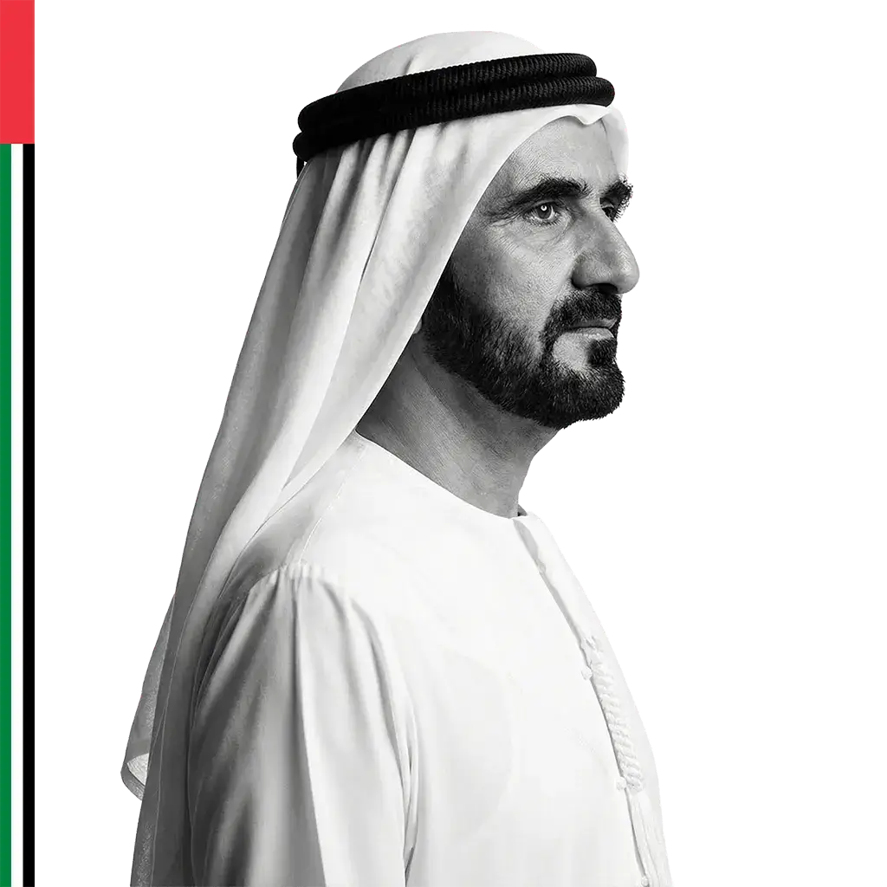

# ProudU.ae 🇦🇪



Free patriotic content generator for the people and businesses of the UAE.

**[proudu.ae](https://proudu.ae)**

## What it does

- **Flag My Photo** — Add a patriotic frame to your profile picture. 8 styles to choose from.
- **Proud Post Maker** — Create branded patriotic posts for your business. Multiple templates, formats, and preset messages in English and Arabic.
- **Wallpapers** — Download patriotic UAE wallpapers for phone and desktop.

## Why it exists

When Sheikh Mohammed called on everyone to raise the flag, brands responded instantly with beautiful content. Regular people and small businesses didn't have the tools to do the same. ProudU closes that gap.

Free. Forever.

## Privacy by design

- 100% client-side. All image processing happens in your browser via Canvas API.
- No backend. No database. No auth. No cookies (except language preference).
- Your photos are never uploaded to any server. They never leave your device.
- No analytics trackers. No ads. No data collection.

## Tech stack

- **Framework:** Next.js 14+ (App Router)
- **Language:** TypeScript
- **Styling:** Tailwind CSS
- **Image processing:** HTML Canvas API (client-side)
- **Deployment:** Vercel
- **Fonts:** Inter (EN), Tajawal (AR)

## Features

- Bilingual English/Arabic with full RTL support
- Mobile-first (74% of traffic is mobile)
- 8 photo frame styles (Proud Ribbon, Proud Badge, Proud Fade, Proud Circle, Proud Frame, Proud Wave, Proud Pin, Proud Tail)
- Multiple post formats (square, portrait, story, landscape)
- Preset messages in EN/AR
- Verified Sheikh Mohammed quotes from the official sheikhmohammed.ae API
- UAE flag colors and proportions follow official guidelines
- Every generated image includes a subtle "proudu.ae" watermark

## Getting started

```bash
git clone https://github.com/mahdi-salmanzade/proudu.git
cd proudu
npm install
npm run dev
```

Open [http://localhost:3000](http://localhost:3000).

## Project structure

```
app/
├── page.tsx                 # Homepage
├── flag-my-photo/page.tsx   # Photo framing tool
├── post-maker/page.tsx      # Branded post creator
├── wallpapers/page.tsx      # Wallpaper gallery
├── about/page.tsx           # About page
├── privacy/page.tsx         # Privacy policy
├── terms/page.tsx           # Terms of use
└── flag-guidelines/page.tsx # UAE flag etiquette
```

## Contributing

Contributions welcome. Some areas where help is needed:

- New frame styles and post templates
- Arabic copy improvements (native speakers especially welcome)
- Accessibility improvements
- Performance optimization for older mobile devices
- New wallpaper designs

Please respect the UAE flag in all contributions. All flag representations must use correct proportions (2:1) and official colors.

## UAE flag colors

| Color | Hex | Meaning |
|-------|-----|---------|
| Red | `#EF3340` | Courage and sacrifice |
| Green | `#009739` | Growth and prosperity |
| White | `#FFFFFF` | Peace and honesty |
| Black | `#000000` | Strength and determination |

## License

MIT

## Disclaimer

ProudU.ae is an independent community tool. It is not affiliated with, endorsed by, or connected to any UAE government entity.

---

Built with ❤️ in the UAE by [Mahdi](https://linkedin.com/in/mahdisalmanzade)
